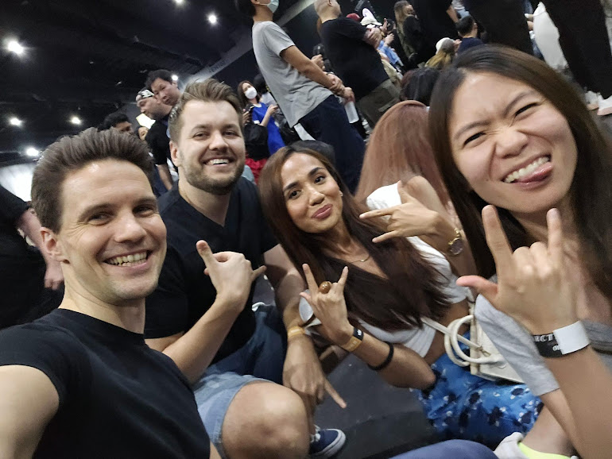
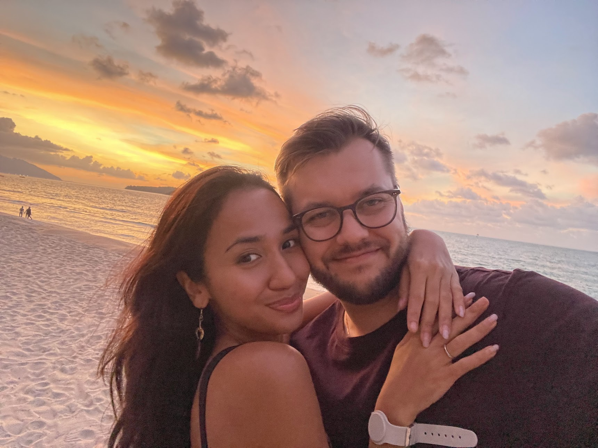
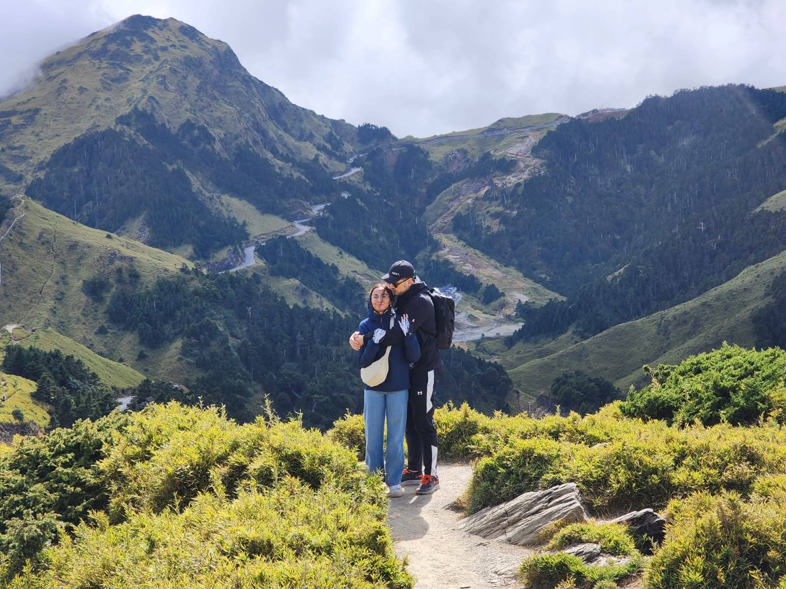
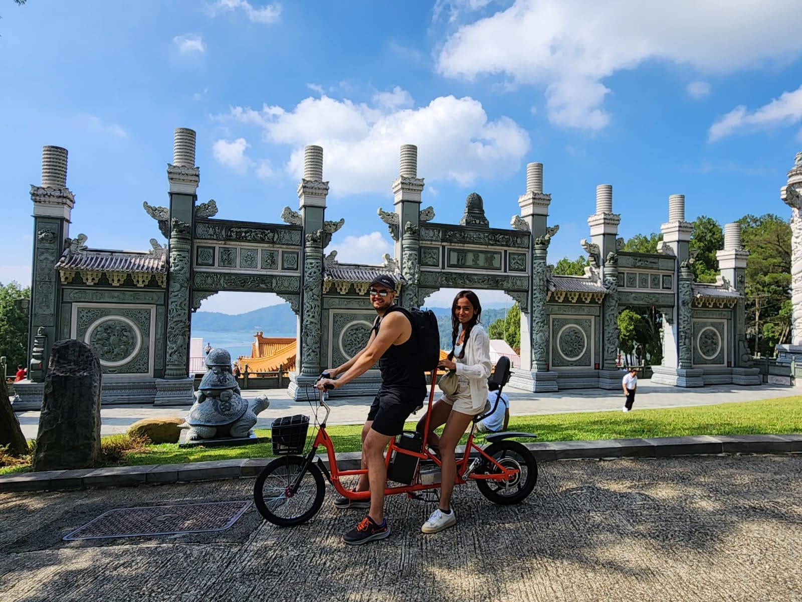
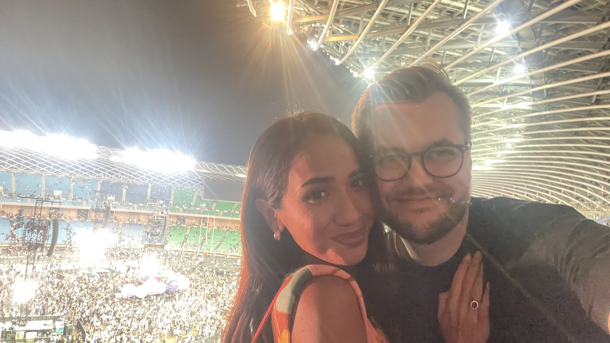
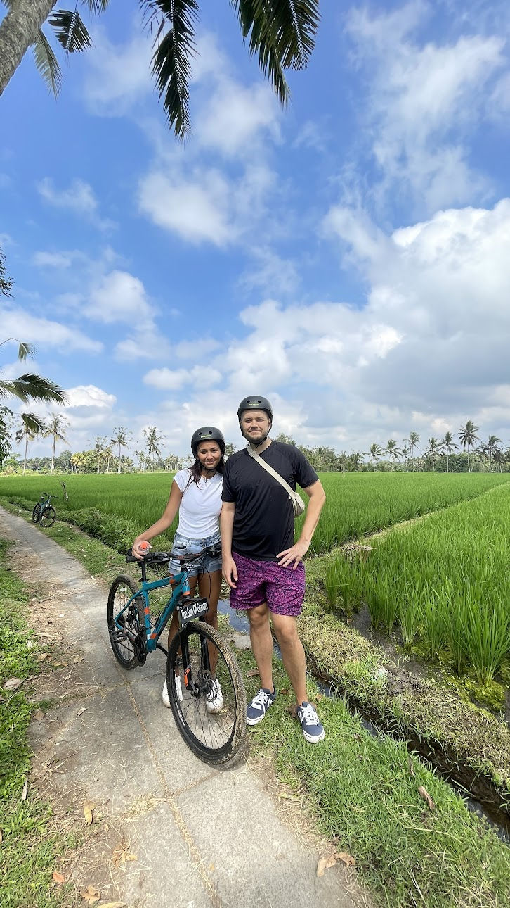
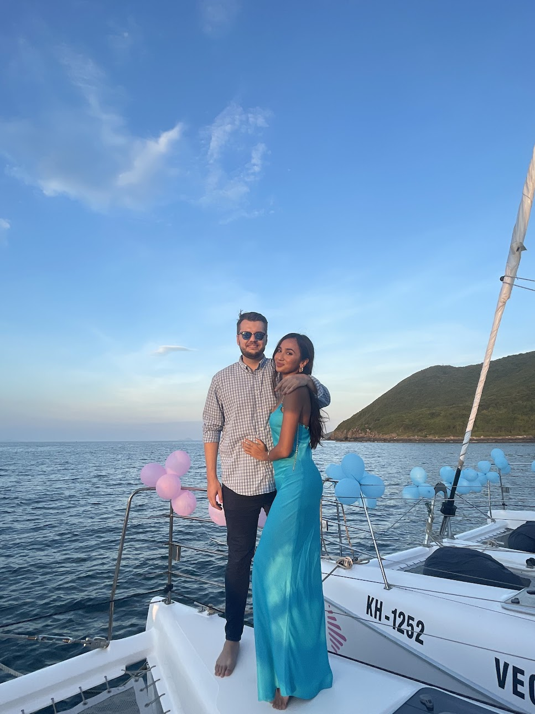
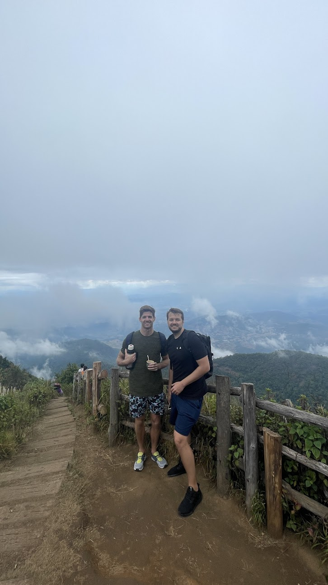

2023 was a year of **stability** and **experiences**.

I had major life events happen, including making the most important decision of my life. I travelled more than ever (outside of work), focused on health and gym consistency, and tried to nourish significant relationships after the long hiatus of the post-COVID world.

## Highlights

### Getting married (twice)

They say who you marry will pretty much dictate the quality of your life.

In April, Sarah and I had our Nikah ceremony surrounded by close friends. Then in June, we made it official at the Registry of Marriage in Singapore.

Our relationship started with randomness that turned into a fast-track boot camp in 2020 when we moved in together during the pandemic. We were isolated in a small studio apartment in the east of Singapore for at least a year. Despite that, we made it work. In fact, it was really fun.

I am incredibly grateful to have a person in my life who is kind, generous, supportive, and full of infectious optimism. As her sister likes to say, she brings "color" into my life.

### Travel everywhere

I've never travelled so much in one year. Arctic Monkeys in Bangkok, a friend's wedding in Vietnam, multiple Bali trips, Taiwan with Coldplay, and Chiang Mai to close the year.

## Lowlights

### Living on auto-mode

When review time came, it was hard to recall what had happened. The year felt like a blur. I wasn't present enough and spent too much time in front of my laptop instead of being intentional about my days.

### Not shipping anything

I sunk time into learning to code but didn't commit to any projects. My inertia and analysis paralysis crippled me with fear of judgement. I didn't even start, despite committing to shipping back in 2021. This remains my biggest regret.

### Health slipping

I kept bouncing back to sugar drinks, alcohol and cigarettes. BFT was great for consistency but I couldn't lose weight. Mid-year I hurt my knee doing Bulgarian squats.

## Learnings

- I might not be a great entrepreneur, but I love building products
- I am drained by bullshit work (PowerPoint decks, synchronous meeting culture, admin)
- Simple married life suits me. Feeling responsible for another human grounds me
- Nature energizes me. Being in a city routine kills my soul despite the convenience
- Being too comfortable increases fragility and dependency

### On myself

This year I identified some of my parts:

- A part that prefers safety over risk, likely from family instability that brought chaos. I seek predictability because I had traumatic experiences with chaos.
- A part uncomfortable with leisure because it feels I don't deserve it due to wasted time. It pushes me to always do something.
- A part afraid of success, so I fill time with distractions like consuming content instead of putting myself out there.

## Life dimensions

| Area | Score | Note |
|------|-------|------|
| Health | 5/10 | Need to kick bad habits and be consistent |
| Family | 5/10 | See them once a year due to distance |
| Friends | 7/10 | Decent support system but not intentional enough |
| Romance | 8/10 | Highlight of the year, though we had serious fights that taught us both |
| Money | 8/10 | Decent savings despite high cost of living |
| Career | 4/10 | Less learning, less motivation, negative market sentiment |
| Spirituality | 0/10 | Didn't explore this at all |
| Growth | 7/10 | Learned more about myself, considering therapy |

## Core memories

- Our Nikah and ROM ceremonies
- Arctic Monkeys in Bangkok
- Men, I Trust concert
- Coldplay in Taiwan
- All the Bali trips
- Friend's wedding in Vietnam
- Langkawi with paragliding
- Chiang Mai with Joel
- New Year on a boat at Similan Islands
- Playing tennis after a decade
- Meeting internet friends in person
- Restarting my journey to code

## Gratitude

Sarah, for being my partner in crime and uplifting my seriousness. She brings light to my day and whenever she smiles at me in the middle of the MRT before we head to meet friends, it just puts me in place.

My nona Nadya, for still being strong. I want to introduce Sarah to her.

Everyone who made this year memorable despite my confusion about direction and identity.

---

Looking ahead to 2024: running experiments, changing environment, tapping into mindfulness, and figuring out what I actually want to spend my time on.
