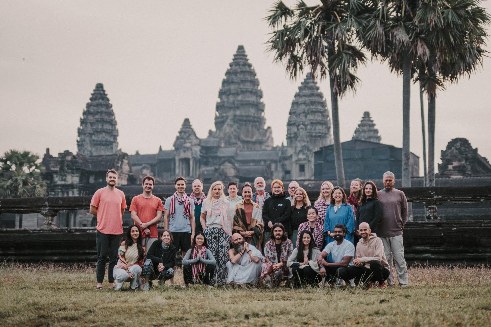
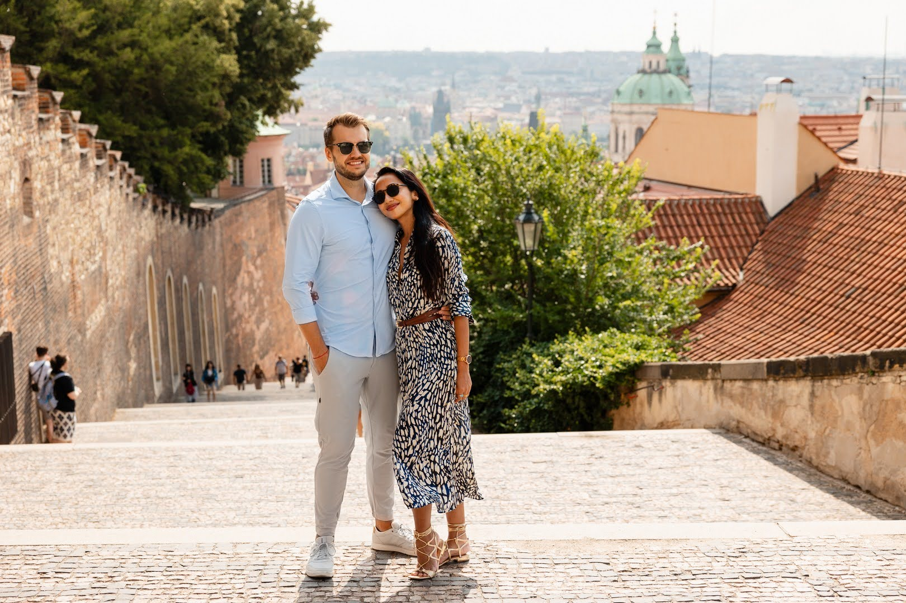
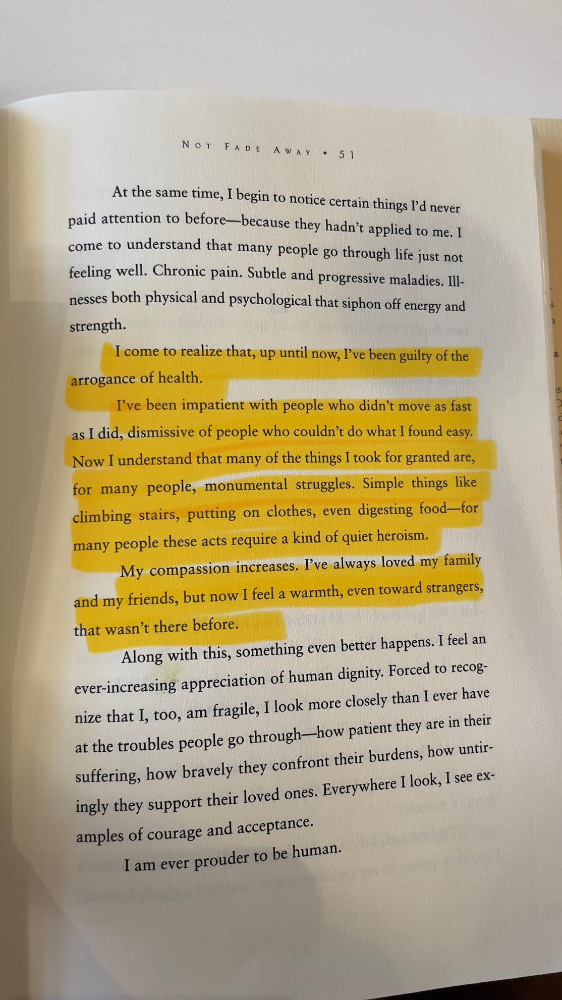

Hello from Ubud, Bali!

Sporadically, I write annual reviews and reflect on my highlights, lowlights and lessons. You can check what happened [last year](/posts/2024/).

## TL;DR

2025 was my year of taking a bet on myself.

I kept traveling with my wife, tried to keep my life in balance, quit my job, thought of going on sabbatical but gave in to my curiosity and started a project.

It was a strange year, mostly because both halves felt like two completely different seasons of life. The first half was about working a job and moving around. The second was about doubling down on my own definition of good work while dealing with doubts and uncertainty.

## 2025 goals

| Area          | Score | Goals                                                                                             | Notes                                                                                                                                              |
| :------------ | :---- | :------------------------------------------------------------------------------------------------ | :------------------------------------------------------------------------------------------------------------------------------------------------- |
| Work          | 4/5   | 🟢 Make one risky bet   ​🟡 Ship a paid product                                               | Started Keepsake but didn't release yet to the public                                                                                              |
| Money         | 1/5   | 🔴 50% of income -> ETF                                                                           | No disposable income, no investments                                                                                                               |
| Health        | 4/5   | 🟡 >20% body fat  ​🟢 +3kg muscle  ​🟡 Play tennis at least 50x  ​🟢 Supplements  | ​Went over 20%  Gained some weight after a bulk  ​​Played tennis consistently only in Q4  ​Magnesium, creatine, fish oil intake stable |
| Relationships | 4/5   | 🟢 >1 meaningful connection  ​🟢 Keep in touch with friends  ​🟢 Call my mum once a month | Met new friends online by reaching out  ​Made an effort with core group  Tried to chat with mum weekly/bi-weekly​                          |
| Growth        | 5/5   | 🔴 Write 12 articles  ​🟢 Soft skills   ​🟢 Technical skills                              | Only finished 2 posts  ​Attended ultraspeaking cohort  Learned a tonne with Claude Code                                                    |
| Play          | 4/5   | 🟢 Attend 1 music event  ​🟢 Severance S2  ​🔴 Read 12 books                              | Saw [Ben Böhmer](https://open.spotify.com/artist/5tDjiBYUsTqzd0RkTZxK7u) at Cafe Del Mar  Fun goal, but disappointing content  Managed to read 4 books only |
| Spirituality  | 3/5   | 🟡 Meditate for 150 days  ​🟢 Attend a retreat                                                | Meditated for 84 days  ​Attended [Hariharalaya](https://www.hariharalaya.com/) in Cambodia                                                     |

## Timeline

We continued traveling, meeting family and friends in different countries, exploring nature and cities, and creating new core memories. Here are a few that stood out.

### Thailand

Four months in Thailand—visiting Koh Surin, Khao Lak, Phuket and living near Bang Tao beach.

### Cambodia

Visiting Siem Reap for the first time and attending a 7-day retreat with yoga, silence, 5am sunrise meditation, and Angkor Wat.

### Turkey

Seeing my dad after 7 years and introducing him to my wife in Istanbul. Eating Turkish breakfast every day, drinking pomegranate juice, and playing with all the cats. Unpleasant bonus: experiencing my first earthquake.

### Spain

Slowing down and living on the outskirts of Spain. Visiting Barcelona and Valencia for the first time.

### Czech Republic

Getting lost in Prague, the city I grew up in, and celebrating my friend's 40th birthday.

## Highlights

- The biggest decision this year was to [quit my job](/posts/stuff-i-learned-at-delivery-hero/). It wasn't easy—I felt valued, had wonderful colleagues, and overall there were more benefits than downsides. But I was closing in on burnout again.
- My hands started itching a week into sabbatical. I wanted to see how far I could push LLMs to build something meaningful, something close to my heart. So I got my Claude Code Max subscription from Anthropic, fired up Sonnet 3.7, and got going. What started as an experiment to learn how to work with language models became [Keepsake](https://www.makekeepsake.com).
- I tried to keep in touch with people mindfully this year. It's hard to maintain relationships as adults, but I'm grateful to have a core group of people from various corners of the world who help me keep my sanity.
- My marriage hit 2 years and 1 year since our wedding ceremony. Looking back at all the pictures and videos brought a lot of memories and tears—seeing everyone we love in one place. We've also developed as individuals and kept each other in check with honesty and hard work on our triggers.
- I hit the gym 180 times this year. Meditated at least 80 days and restarted playing tennis in Bali, a sport I played as a kid and regret not taking seriously. Eating clean was easy and I maintained a high protein diet with supplements (omega, creatine, magnesium). I also improved my sleep with earplugs—honestly such a worthy hack. Overall my stress level decreased significantly, but I still struggle with anxiety (more on that in lowlights).

## Lowlights

- **Auto-pilot mode** — My second half of the year turned into a blur, which I was so adamant about avoiding. I hit 16-hour days with breaks only for food and gym, and sustained that pace for around 4 months. Then I started having minor anxiety attacks and bursts of complete apathy. Despite being in the flow and building, it feels like I'm both present and completely oblivious to everything outside of it. There's something addictive about assisted coding.
- **Money** — I didn't plan to replace my income and was going to live off savings. It never felt scary since my taste isn't exactly expensive and I've done sabbaticals a few times already. I knew I wanted to take a break to focus on myself—journaling, writing, exploring hobbies I had long forgotten—with the trade-off that it obviously stings financially. Having the time and space to do things I really want to do is an incredible privilege. Years of hard work (and luck) actually paid off.
- **Uncertainty** — With extended time off comes this weird feeling that the world is moving and I'm falling behind. Especially in tech, where I spent the last decade as a product manager and which is currently undergoing a seismic shift due to LLMs. I've quit my job twice without any plan and went on months of exploration, yet this feeling is still pervasive. I've done a lot of internal work to be okay with it, but the tension still holds. Overworking and not seeing the fruits of labor right away sparks moments of weakness where I ponder "WTF am I doing?". The root cause is probably years of societal programming, relying on a paycheck, and as an immigrant, being in constant survival mode. The issue is that knowledge is not understanding—rationalization doesn't really bring calm. The only antidotes I've found helpful are weightlifting, movement, meditation, and catch-ups with people going through the same thing.

## Consumption

Various work, storytelling, art and creativity that I enjoyed this year.

- [Not Fade Away by Laurence Shames and Peter Barton](https://www.goodreads.com/book/show/137554.Not_Fade_Away) — I didn't read much this year, but over the past few years I've developed an appreciation for books about living life well. Not Fade Away is a story of Peter Barton, a man who tried to live his life to the fullest while fighting for his life and trying to understand what really matters.
  

- **[Ultraspeaking](https://ultraspeaking.com/)** — A bit of a mixed bag for me. I heard raving reviews online and had high expectations. I only participated in the fundamentals course and felt like a lot of learning was outsourced to async games with breakout rooms. I'd still recommend it though.

- [Andor](https://www.youtube.com/watch?v=-asb8zTiuZ4) was my favourite piece of fiction this year by a large margin. The manifesto is brilliant—one of the best monologues I've seen. It's one of those rare masterpieces that don't come out often these days.

- I'm not much of a gamer these days, but with all the rumours about Half-Life 3 coming out together with the [Steam Machine](https://store.steampowered.com/), I replayed [Half-Life 2](https://store.steampowered.com/app/220/HalfLife_2/) and it still holds up really well. This got me on a streak of trying [Bioshock](https://store.steampowered.com/app/409710/BioShock_Remastered/) for the first time, which depicts an objectivist dystopia going wrong—how absolute self-interest, power concentration, and ethics-free science breed exploitation.

- This is also the year I got into anime. I never found it compelling, but a few years back I finished [Attack on Titan](https://myanimelist.net/anime/16498/Shingeki_no_Kyojin) which got me deep into the genre and its weird yet creative storytelling. I've since finished a few classics: [Fullmetal Alchemist: Brotherhood](https://myanimelist.net/anime/5114/Fullmetal_Alchemist__Brotherhood), [Steins;Gate](https://myanimelist.net/anime/9253/Steins_Gate), [Vinland Saga](https://myanimelist.net/anime/37521/Vinland_Saga), [Solo Leveling](https://myanimelist.net/anime/52299/Ore_dake_Level_Up_na_Ken), and [Jujutsu Kaisen](https://myanimelist.net/anime/40748/Jujutsu_Kaisen). All fantastic places to start.

- My most listened to music was mostly focus and work-related stuff from artists like [Tycho](https://open.spotify.com/artist/5oOhM2DFWab8XhSdQiITry), [Croquete Club](https://open.spotify.com/artist/6Fn7vKaPgzA6AAIb7EhhV6), [Koresma](https://open.spotify.com/artist/14EybDMySlkntyuxgm1pek), [Catching Flies](https://open.spotify.com/artist/4zAOqBfNLyWFvj1e3yvypJ), and the [Anjunadeep](https://open.spotify.com/user/anjunadeep) catalogue.

## 2026

This year I'm not setting goals. Regardless of what I commit to, things change, and there's an internal force that drives my wants and needs more than wishful thinking does.

My only intention is to launch [Keepsake](https://www.makekeepsake.com/) for beta users, keep working on the product and myself, and welcome life with open arms regardless of what it brings.
