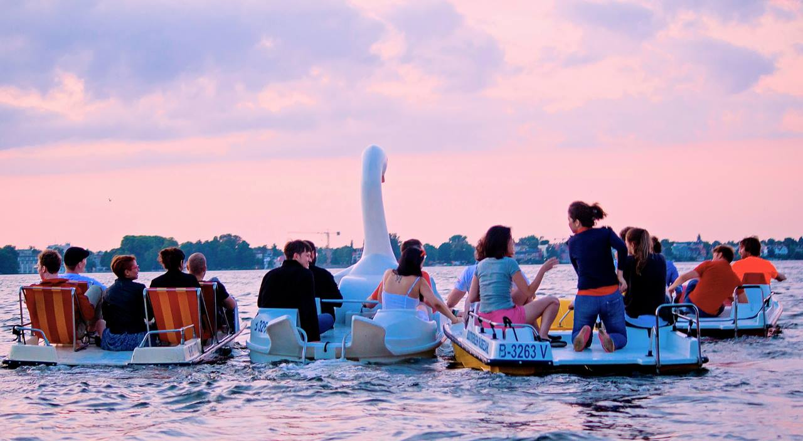

Hey there 👋, thanks for checking a more extensive version of my humble brag!

## Why

The reason this corner of the internet exists is due to continuously seeking greater understanding. It fulfils the genuine desire and insatiable curiosity to comprehend the complexities of the world and the people within it as a quality that fosters growth, empathy and connection. It opens the door to move beyond surface-level judgement and assumptions, allowing for the richer, more meaningful interactions. This is a mechanism to cope with the chaos and eternal change of the world as well as to do my best to exercise open-mindedness, compassion and kindness. The future state of the world can be different than the present.

## Milestones

**2010** - Landed my first job in [private equity fund](https://www.enercap.com/) and helped raise **over $200m in debt financing** for renewable energy projects in CEE with an impact of saving 130,000 tonnes of carbon p.a. powering 200,000 households.

**2011** - Started my first startup that copied a [business model](https://thehustle.co/how-one-of-the-worlds-fastest-growing-startups-burned-through-300m/) from US. After incorporation, printing flyers and business cards, we realized we had 0 customers. Learned how not to start a company.

**2012** - Moved to Berlin during the boom of start-up copycat models and joined a growing [venture studio](https://ioniq.com/portfolio/) that is now spanning fintech, adtech and healthech portfolio. This has been a fantastic experience in understanding shifting technology cycles. We saw mobile overtaking web traffic from the front-row seats and opportunities it brought.

**2014** - Started a mobile-first user acquisition agency and reached **$30k in revenue the first month**. It was the first digital nomad experience whilst living and travelling in Thailand. A year later my bank sent me a cease and desist letter and I had to close down. I learned a lot about perseverance and stress but also independence and non-default paths.

**2015** - Joined a [seed stage startup](https://venturebeat.com/2014/10/03/1-million-seed-funding-led-by-point-nine-capital-investing-in-remerge-was-a-no-brainer-for-us/) in Berlin and went from 0 revenue to one of the industry leaders in mobile advertising. We grew **from 10 people to 160 employees** and I was lucky to experience a true **0 to 1 startup scale-up story** including market launch in 7 different countries.

**2016** - Took a career break and spent time with my family. Also learned about ethereum and participated in ICO wave of 2017. Spent the year learning to code, understanding crypto and launched a newsletter focusing on educational content.

**2018** - Made a move to Singapore and worked with the largest C2C marketplace in SEA on a platform utilising blockchain and external data to identify bad actors. Met some of the most amazing entrepreneurs in the region and engraved myself in the VC ecosystem.

**2020** - Got accepted into an [early-stage start-up programme](https://www.antler.co/) and worked on a machine learning ops product to help push models into production faster. This was a breaking point in my own mental model of how the world works, probability and why venture model is not a good fit for majority of the founders. It was such a great experience though that again provided a chance to learn from the best in the industry.

**2021** - A complete professional fiasco. I got a chance to interview for my dream job, completely messed it up and ended up in a toxic environment, followed by a stint in a feature factory.

**2022** - Recovered and balanced, focusing on upskilling and cementing my way as product manager. Learned a lot at a scale where every decision can potentially result in millions of revenue (or losses).

## NOW (updated: 2023-10-01)

I am currently based in Singapore and work as a principal product manager. During nights and weekends I like to study, learn, code and design. For leisure, I like to hike whilst talking to other curios people which lead me to create RidgeWalks. Join me!
I am obsessed with the idea of Salons and adult friendships. I am a small investor in [Calm company fund](https://calmfund.com/) and [Replit](https://replit.com/)

## Interests

### Code

I went back part-time self-teaching rabbit-hole because I want to be able to get an API working, or launch a front-end of GPT-3 model, play with procedural algorithmic art. There is just so much cool stuff going on that it makes me feel like I am a kid discovering multiplayer Doom and "IDDQD". Currently working with TypeScript, Next.js, Prisma, tRPC and Supabase/Pocketbase.

### Design

In combination with above, I am also learning about UX/UI and accessibility. I think design is really underrated moat for a lot of products.

### Communities

Trying to be more active in a few communities, mostly focused on solopreneurship and indie-making. I think one of the major contributors to happiness comes from the sense of belonging and having like-minded people around.

### Calm companies

I signed-up for a scout programme from Calm Company Fund and on the lookout for profitable companies or solo devs working on a software product that are seeking to go full-time.

### Second brain

After 2 years of tinkering with Roam, Logseq, Obsidian. I am back on notion as I love the databases mental model and with their upcoming AI feature set it seems like a no brainer. I take less notes these days and don't need backlinks to feel that I am retaining well. What I did discover though is Raycast which feeds into Notion with a super cool extension called Hypesonic for todos.

### Alternative paths

- Being stuck at home during covid really made me think about the choices that I made and path I have chosen. I am a big fan of pathless path and non-conventional journeys of people doing things that are not default. I am still exploring what does it mean for myself though.

Some principles that I hold close:

- Living an examined and calm life
- Exploration & experimentation
- Seeking mastery & expertise
- Beginner's mind and art of starting from scratch
- Lifelong learning and forever student
- Non-convention and non-conformity
- Simplicity and minimalism
- Virtue cultivation
- Individual journey and direction
- Bits of hungriness and foolishnesses

[My DMs are always opened](https://www.twitter.com/kirso_), alternatively you can [book a call](https://cal.com/kirso).
